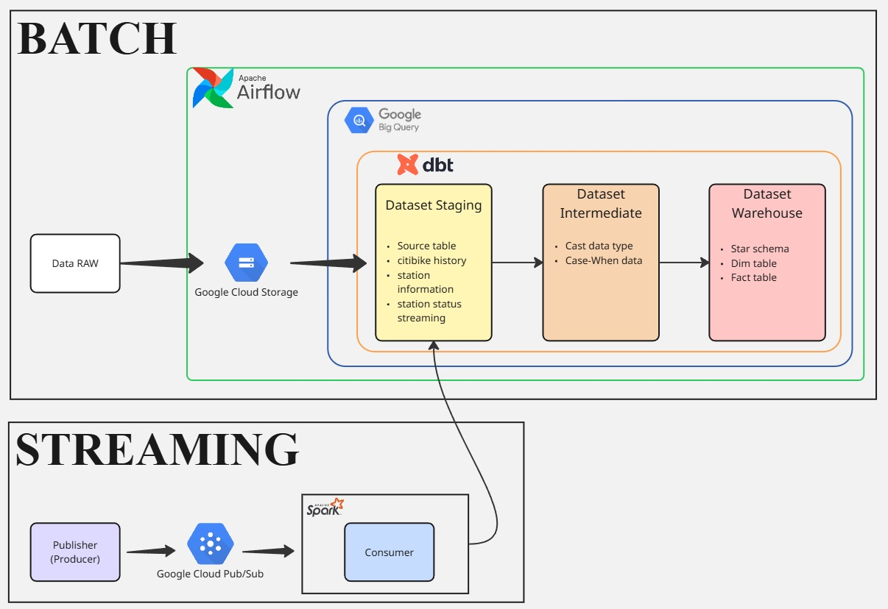

# Citibike Data Pipeline — Jersey City

Pipeline data engineering end-to-end untuk data trip Citibike (Jersey City) dan data referensi stasiun (GBFS), menggunakan Airflow, PySpark, BigQuery, dan dbt.

## Daftar Isi
- [Arsitektur](#arsitektur)
- [Tech Stack](#tech-stack)
- [Struktur Folder](#struktur-folder)
- [Trip History](#trip-history)
- [Station Information](#station-information)
- [Station Status](#station-status)
- [Struktur Model](#struktur-model)
- [Data Quality](#data-quality)
- [Orchestration & Alerting](#orchestration-&-alerting)
- [Keterbatasan-yang-Disadari](#keterbatasan-yang-disadari)
- [Dashboard](#dashboard)
- [Setup & Menjalankan Project](#setup-&-menjalankan-project)
- [Pengembangan Selanjutnya](#pengembangan-selanjutnya)

## Arsitektur



## Tech Stack

| Komponen | Tools |
|---|---|
| Orchestration | Apache Airflow 2.9.2 (Docker) |
| Extract & Transform | Python, PySpark 3.5.3 |
| Messaging (streaming) | Google Cloud Pub/Sub |
| Data Warehouse | Google BigQuery |
| Transformation | dbt-core 1.12.4, dbt-bigquery |
| Storage staging | Google Cloud Storage |
| Alerting | Slack (Incoming Webhook) |
| Dashboard | Looker Studio |
| Runtime | Java Temurin 21 (untuk PySpark), Python 3.11 |

## Struktur Folder

```
Final_Project/
├── dags/
│   ├── citibike_dag.py             # DAG utama (@monthly): trip history + GBFS station_information + dbt
│   └── station_dag.py              # DAG real-time (@daily): refresh dbt model dari data streaming
├── scripts/
│   ├── batch/
│   │   ├── config.py                # load & validasi environment variables
│   │   ├── extract.py               # download data trip & GBFS station_information
│   │   ├── transform.py             # transformasi PySpark
│   │   ├── load.py                  # load ke GCS & BigQuery
│   │   ├── pipeline_batch.py        # orkestrasi pipeline trip history
│   │   └── pipeline_gbfs.py         # orkestrasi pipeline GBFS station_information
│   └── streaming/
│       ├── init_pubsub.py           # memastikan topic & subscription Pub/Sub tersedia (idempotent)
│       ├── publisher.py             # polling GBFS station_status.json tiap 60 detik, publish ke Pub/Sub
│       └── consumer.py              # menarik pesan dari Pub/Sub, transform, load ke BigQuery
├── dbt_runner/
│   ├── models/
│   │   ├── staging/                 # cleaning ringan, dedup
│   │   ├── intermediate/            # durasi & dimensi waktu
│   │   └── warehouse/               # dimension, fact table historis, fact table real-time
│   ├── tests/                       # singular tests
│   ├── macros/
│   │   └── generate_schema_name.sql
│   └── dbt_project.yml
├── credentials/                     # service account JSON (tidak di-commit)
├── docker-compose.yaml
├── Dockerfile
├── requirements.txt                 # dependency Airflow, PySpark, dan streaming (image bersama)
├── requirements-dbt.txt             # dependency dbt (virtual environment terpisah di dalam image)
└── .env.example
```

## Trip History

Sumber data: [Citibike System Data (Jersey City)](https://s3.amazonaws.com/tripdata/index.html), file berprefix `JC-`.

- Extract mendukung banyak file CSV per zip (untuk bulan dengan trip > 1 juta yang dipecah beberapa part).
- Transform (PySpark): casting tipe data, trimming, split per hari (`date_str`) untuk load harian ke BigQuery.
- Load: `WRITE_APPEND` per hari dengan `time_partitioning` (`DAY`, field `started_at`), agar bisa reload/backfill tanpa menimpa hari lain.
- Kolom metadata yang ditambahkan saat transform:
  - `ingestion_at` — timestamp saat proses load berjalan.
  - `source_month` — label bulan batch (`yyyymm`), penting karena trip yang melewati akhir bulan (mis. 30 April → 1 Mei) dapat muncul di lebih dari satu file bulanan sumber.
  - `source_data` — label jenis sumber (`Batch`), untuk membedakan dari sumber streaming.

## Station Information

Sumber data: GBFS `station_information.json` (operator Lyft/Citibike).

- Data ini adalah snapshot atribut stasiun (nama, lokasi, kapasitas) — berubah jarang, sehingga cocok di-fetch secara periodik, bukan streaming per detik.
- Load: `WRITE_APPEND` (bukan `WRITE_TRUNCATE`) — histori snapshot **wajib** disimpan agar model SCD di layer dbt bisa mendeteksi perubahan dari waktu ke waktu.
- Kolom `extracted_at` dicatat di setiap fetch sebagai basis `valid_from` pada SCD Type 2.

## Station Status

Sumber data: GBFS `station_status.json` — berbeda dari `station_information`, data ini berubah tiap ada peminjaman/pengembalian sepeda sehingga cocok dipantau lebih sering.

Pola yang digunakan adalah **micro-batch melalui Pub/Sub**, bukan streaming murni:

1. **`publisher.py`** — proses yang berjalan terus-menerus, melakukan polling ke GBFS API setiap 60 detik dan mempublikasikan hasilnya ke Pub/Sub. Dijalankan sebagai container Docker mandiri (`restart: unless-stopped`), di luar penjadwalan Airflow, karena proses tak-berujung (infinite loop) tidak sesuai dengan model eksekusi task Airflow yang diharapkan selesai.
2. **`consumer.py`** — juga berjalan terus-menerus, menarik pesan yang menumpuk di Pub/Sub setiap 5 menit, mem-flatten struktur JSON dengan PySpark, dan menuliskannya ke BigQuery menggunakan Storage Write API langsung (`writeMethod: direct`), tanpa staging melalui GCS.
3. **`init_pubsub.py`** — memastikan topic dan subscription Pub/Sub tersedia sebelum publisher/consumer berjalan (idempotent, dijalankan sekali di awal sebagai service `pubsub-init`).

Alerting kegagalan pada `consumer.py` dikirim langsung ke Slack melalui HTTP request ke webhook URL (bukan lewat `SlackWebhookHook` Airflow, karena proses ini berjalan di luar Airflow).

`publisher.py`, `consumer.py`, dan `init_pubsub.py` menggunakan image Docker yang sama dengan Airflow (`entrypoint: ""` di-override pada ketiga service ini agar tidak melalui proses inisialisasi khusus Airflow — seperti menunggu koneksi database Airflow — yang tidak relevan untuk script Python biasa).

## Struktur Model

### Staging
- `stg_citibike_trips` — dedup atas kombinasi `ride_id + started_at + ended_at` (bukan `ride_id` saja, karena ditemukan kasus `ride_id` yang sama pada dua trip berbeda). Tiebreaker: prioritaskan baris yang `source_month`-nya cocok dengan bulan asli `started_at`, baru `ingestion_at` terbaru.
- `stg_station_information` — passthrough dari source GBFS station_information.
- `stg_station_status_streaming` — passthrough dari data streaming, dengan casting tipe timestamp.

### Intermediate
- `int_citibike_trips` — menghitung `trip_duration_seconds`/`trip_duration_minutes`, dan derivasi kolom waktu: `started_date`, `started_hour`, `started_day_name`, `is_weekend`, `time_of_day`. Tidak melakukan enrichment stasiun atau flagging kualitas data — keduanya dipindahkan ke layer warehouse agar dihitung setelah data lengkap.

### Warehouse
- `dim_station` — dimension table stasiun dengan **SCD Type 2** yang diimplementasikan manual menggunakan window function `LAG()` (deteksi perubahan atribut) dan `LEAD()` (menentukan `valid_to`). Kolom: `station_sk` (surrogate key hash), `valid_from`, `valid_to`, `is_current`.
- `fct_citibike_trips_enriched` — fact table hasil **point-in-time join** `int_citibike_trips` ke `dim_station` (melalui kolom `short_name`, dengan kondisi `started_at BETWEEN valid_from AND valid_to`), dengan fallback join berdasarkan nama stasiun jika `station_id` kosong. `data_quality_flag` dihitung di sini, sekali, setelah proses enrichment selesai.
- `fct_station_hourly_traffic` — aggregate fact table (jumlah trip, rata-rata durasi) per jam, per stasiun, per tipe member, per tipe sepeda. Dibangun di atas `fct_citibike_trips_enriched`, bukan dihitung ulang dari nol.
- `fct_station_status_current` — snapshot kondisi terkini tiap stasiun (1 baris per stasiun) dari data streaming, di-enrich dengan `dim_station` melalui `station_id` (format UUID pada data streaming sama persis dengan `dim_station`, sehingga tidak memerlukan `short_name` seperti pada data trip).
- `fct_station_demand_vs_supply` — menggabungkan pola historis (`fct_station_hourly_traffic`, rata-rata trip pada jam & hari yang sama) dengan kondisi ketersediaan sepeda saat ini (`fct_station_status_current`), menghasilkan kategori `supply_status` (`empty`, `full`, `normal`, `no_historical_data`) per stasiun.

## Data Quality

Pengecekan data quality diterapkan dalam dua bentuk:

1. **dbt tests** (otomatis, dijalankan sebagai bagian dari pipeline Airflow):
   - Generic: `not_null`, `unique`, `accepted_values`, `relationships`.
   - Singular: pengecekan duplikat, konsistensi flag, konsistensi durasi, dsb.
   - Pipeline berhenti otomatis (dan mengirim alert Slack) jika test gagal di layer staging/intermediate, mencegah data tidak valid diproses lebih lanjut.

2. **`data_quality_flag`** pada `fct_citibike_trips_enriched` — setiap baris dikategorikan (`valid`, `missing_start_data`, `missing_end_data`, `negative_duration`, `zero_duration`, `excessive_duration`) alih-alih dibuang. Baris bermasalah tetap tersimpan untuk keperluan audit.

## Orchestration & Alerting

- **DAG `citibike_pipeline_dag`** (`@monthly`): membuat bucket/dataset (idempotent) → load trip & GBFS station_information ke BigQuery → menjalankan model dan test dbt secara berurutan (staging → intermediate → warehouse), dengan gerbang kualitas (`dbt test`) di antara setiap layer.
- **DAG `station_status_dag`** (setiap 10 menit): menjalankan model dbt untuk data streaming (`stg_station_status_streaming`, `fct_station_status_current`, `fct_station_demand_vs_supply`) beserta test-nya. Dipisah dari DAG utama agar frekuensi refresh sesuai dengan sifat data yang berubah cepat, tanpa perlu menunggu jadwal bulanan.
- Kegagalan task pada kedua DAG mengirim notifikasi ke Slack melalui `on_failure_callback`, berisi nama DAG/task, waktu gagal, alasan, dan tautan log.
- dbt dijalankan dari virtual environment terpisah di dalam container Airflow (`/opt/airflow/dbt_venv`) untuk menghindari konflik dependency dengan package bawaan Airflow.
- Airflow menggunakan `SequentialExecutor`, sehingga hanya satu task (dari DAG manapun) yang dapat berjalan pada satu waktu. Karena DAG batch berjalan jarang (bulanan) dan DAG real-time berjalan singkat, potensi tabrakan jadwal jarang terjadi dan tidak menyebabkan kegagalan — hanya menunda eksekusi beberapa menit jika kebetulan bersamaan.

## Keterbatasan yang Disadari

- **Region mismatch pada join `dim_station`**: data trip berasal dari sistem Jersey City (`station_id` berformat `JC018`, `HB103`), sedangkan `station_id` asli pada GBFS berupa UUID panjang. Join pada data trip dilakukan melalui kolom `short_name` pada GBFS yang formatnya sesuai dengan `station_id` pada data trip. Data streaming (`station_status`) tidak mengalami masalah ini karena `station_id`-nya sudah berformat UUID yang sama persis dengan `dim_station`.
- **Snapshot GBFS station_information baru dimulai belakangan** (sekitar September 2026), sedangkan data trip historis mencakup periode sebelumnya (April–Agustus 2026). Sebagian kecil trip merujuk ke stasiun yang tidak ditemukan pada snapshot GBFS (kemungkinan sudah tidak aktif sebelum periode monitoring dimulai), sehingga tidak dapat di-*enrich* sepenuhnya. Test `relationships` pada kasus ini diberi `severity: warn` agar termonitor tanpa menghentikan pipeline.
- **SCD pada `dim_station` bermakna penuh setelah beberapa kali fetch** — dengan satu kali snapshot, seluruh baris akan berstatus `is_current = true` tanpa histori perubahan.
- **Pipeline streaming bersifat micro-batch (near real-time)**, bukan streaming murni — ada jeda antara kejadian sebenarnya dan data tersedia di BigQuery, sebesar polling interval publisher (60 detik) ditambah interval consumer (5 menit). Pola ini dipilih karena granularitas tersebut sudah memadai untuk use case ketersediaan sepeda, dan konsisten dengan penggunaan PySpark yang diterapkan di seluruh bagian pipeline lainnya.
- **Versi PySpark dikunci ke 3.5.3** (bukan versi terbaru) karena connector `spark-bigquery-with-dependencies_2.12:0.34.0` yang digunakan tidak kompatibel dengan Spark generasi 4.x — ditemukan melalui error `NoClassDefFoundError: scala/Serializable` saat pengujian.

## Dashboard

Dashboard dibangun di **Looker Studio**, terhubung langsung (live connection) ke tabel-tabel warehouse di BigQuery:
- `fct_citibike_trips_enriched` dan `fct_station_hourly_traffic` — analisis pola historis (tren bulanan, jam sibuk, perbandingan member/casual, top stasiun).
- `fct_station_status_current` dan `fct_station_demand_vs_supply` — analisis ketersediaan sepeda real-time dan potensi ketidakseimbangan stok per stasiun.

## Setup & Menjalankan Project

Panduan lengkap dari clone repository sampai memastikan seluruh pipeline (batch, streaming, dbt) berjalan.

### 1. Clone repository

```bash
git clone https://github.com/BayuTriR/etl_pipeline_final_project.git
cd Final_Project
```

### 2. Siapkan environment variables

```bash
cp .env.example .env
```

Buka `.env`, isi seluruh variabel berikut:

| Variabel | Keterangan |
|---|---|
| `PROJECT_ID` | ID project GCP |
| `GCS_BUCKET_NAME`, `GCS_FOLDER_PREFIX` | Nama bucket GCS dan prefix folder staging |
| `DATASET_STAGING`, `DATASET_INTERMEDIATE`, `DATASET_WAREHOUSE` | Nama dataset BigQuery per layer |
| `CITIBIKE_TEMPLATE_URL` | Template URL S3 data trip Citibike (Jersey City) |
| `STATION_INFO_URL` | URL GBFS `station_information.json` |
| `STATION_STATUS_URL` | URL GBFS `station_status.json` |
| `GOOGLE_APPLICATION_CREDENTIALS` | Path ke file service account JSON (mis. `/opt/airflow/credentials/nama-file.json`) |
| `AIRFLOW_CONN_GOOGLE_CLOUD_DEFAULT` | `google-cloud-platform://` (memicu Application Default Credentials) |
| `TOPIC_ID`, `SUBSCRIPTION_ID` | Nama topic & subscription Pub/Sub untuk pipeline streaming |
| `AIRFLOW_CONN_SLACK_DEFAULT` | Format `slackwebhook://:TOKEN_TERENCODE@/?timeout=42`, untuk alerting dari dalam Airflow |
| `SLACK_WEBHOOK_URL` | URL webhook Slack apa adanya (tanpa encoding), untuk alerting dari `consumer.py` yang berjalan di luar Airflow |

### 3. Siapkan service account GCP

Tempatkan file JSON service account (dengan akses ke BigQuery, GCS, dan Pub/Sub) pada folder `credentials/`, dengan nama file yang sama seperti yang tertulis di `GOOGLE_APPLICATION_CREDENTIALS`.

### 4. Bangun dan jalankan seluruh service

```bash
docker compose up -d --build
```

Proses build akan memakan waktu beberapa menit pada percobaan pertama (mengunduh base image, Java, dan dependency Python). Perintah ini menjalankan:
- `airflow-init`, `airflow-webserver`, `airflow-scheduler` — orkestrasi batch dan dbt.
- `pubsub-init` — memastikan topic & subscription Pub/Sub tersedia (berjalan sekali, lalu berhenti dengan status sukses).
- `gbfs-publisher`, `gbfs-consumer` — pipeline streaming, berjalan terus-menerus.

Periksa status seluruh container:

```bash
docker compose ps
```

Semua service seharusnya berstatus `Up`, kecuali `pubsub-init` yang statusnya `Exited (0)` — ini normal karena tugasnya hanya berjalan sekali di awal.

### 5. Aktifkan DAG di Airflow

Buka [http://localhost:8080](http://localhost:8080) (login: `admin` / `admin`). Aktifkan (toggle ON) kedua DAG:
- `citibike_pipeline_dag`
- `station_status_dag`

Untuk menjalankan pipeline batch tanpa menunggu jadwal bulanan, trigger `citibike_pipeline_dag` secara manual melalui tombol ▶ di Airflow UI.

### 6. Memantau pipeline streaming

Pipeline streaming berjalan independen dari Airflow. Pantau lewat log container:

```bash
docker compose logs -f gbfs-publisher
```
Setiap ±60 detik akan muncul baris `Mengambil data batch dari ...` diikuti `Berhasil publish ke Pub/Sub. Message ID: ...`.

```bash
docker compose logs -f gbfs-consumer
```
Setiap ±5 menit akan muncul `Menarik pesan dari Pub/Sub subscription: ...`, diikuti `Berhasil menarik N pesan.`, `Menulis ke BigQuery: ...`, dan `Berhasil dimuat ke BigQuery!`. Jika Pub/Sub belum ada pesan baru, akan muncul `Tidak ada pesan baru di Pub/Sub.` — ini normal, bukan kegagalan.

Untuk menghentikan sementara pipeline streaming tanpa mematikan Airflow:
```bash
docker compose stop gbfs-publisher gbfs-consumer
```
Menjalankan kembali:
```bash
docker compose start gbfs-publisher gbfs-consumer
```

### 7. Verifikasi data di BigQuery

Buka BigQuery console pada project GCP yang digunakan, periksa tabel-tabel berikut sudah terisi:
- `<DATASET_STAGING>.citibike_trips`
- `<DATASET_STAGING>.gbfs_station_information`
- `<DATASET_STAGING>.station_status_streaming`
- `<DATASET_WAREHOUSE>.dim_station`, `fct_citibike_trips_enriched`, `fct_station_hourly_traffic`, `fct_station_status_current`, `fct_station_demand_vs_supply`

### 8. Menghubungkan dashboard

Buka [Looker Studio](https://lookerstudio.google.com), buat sumber data baru dengan connector **BigQuery**, pilih project dan tabel warehouse yang relevan sesuai kebutuhan analisis.

## Pengembangan Selanjutnya

- Menambahkan unit test untuk memastikan fungsi-fungsi code Python berjalan sesuai ekspektasi.
- Mengeksplorasi penyimpanan database seperti Postgres sebelum data dimuat ke GCS/BigQuery, untuk kebutuhan audit/reprocessing tanpa mengunduh ulang dari sumber.